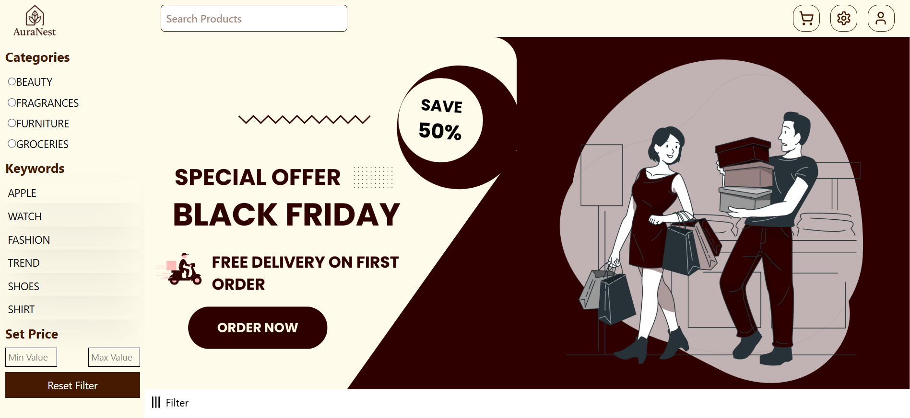
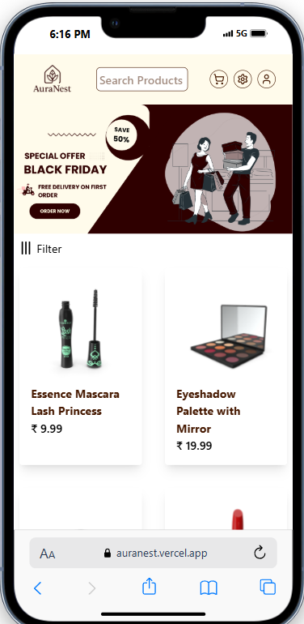
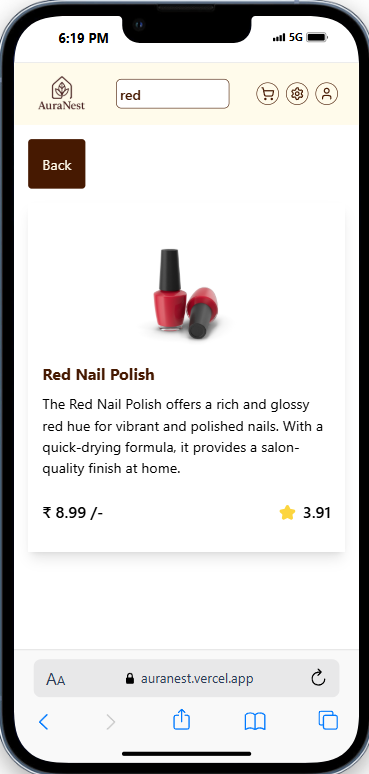

# 🛍️ AuraNest eCommerce Website

A modern, responsive eCommerce web application that allows users to browse and search for products with ease. It includes essential features like keyword search, price filtering, category selection, product pagination, top-selling product highlights, and a section for random blogs.

---

## 🚀 Features

- 🔎 **Search Menu** – Search for products using keywords.
- 💰 **Price Range Filter** – Filter products within a selected price range.
- 🗂️ **Categories** – Browse products by category.
- 📄 **Product Pagination** – Paginated product listings for better user experience.
- 🌟 **Top Sellers** – Showcase of the most popular products.
- 📰 **Random Blogs** – Display of random blogs for user engagement and SEO benefits.

---

## 📸 Screenshots

### 🏠 Home Page with Filters & Banner






> 💡 This screenshot shows the sidebar filters (Categories, Keywords, Price Range), search input, and a promotional banner.

---

## 🧑‍💻 Tech Stack

- **Frontend**: *React, TypeScript, Tailwind*
- **Other Tools**: Axios, etc.

---

## 📦 Installation

```bash
# Clone the repository
git clone https://github.com/your-username/ecommerce-website.git

# Navigate to the project folder
cd ecommerce-website

# Install dependencies
npm install

# Start the development server
npm run dev
